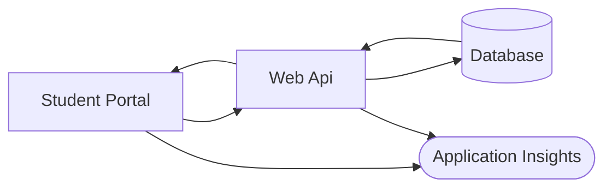
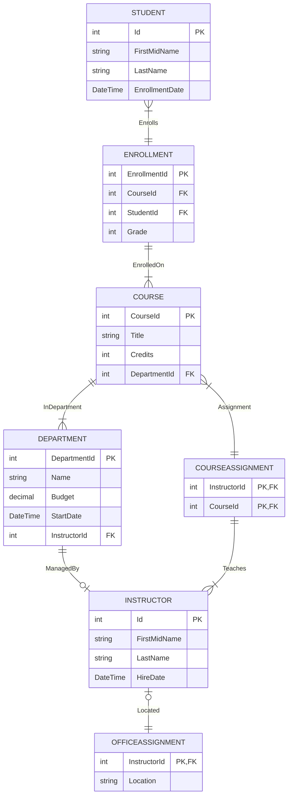

# TFL DevOps Technical Skills Assessment

**Time Limit:** 60 minutes  
**Total Questions:** 3

## Introduction

Welcome to the TFL DevOps Technical Skills Assessment. This is a **60-minute practical assessment** designed to evaluate your problem-solving abilities in a realistic production support scenario.

### The System
You'll be working with a school management system consisting of:
- **ASP.NET Core Web API** - RESTful service layer
- **Razor Pages Student Portal** - Web frontend
- **Azure SQL Database** - Data persistence
- **Application Insights** - Monitoring and diagnostics
- **PowerShell Scripts** - Automation and data management

### Assessment Format
- **Duration:** 60 minutes
- **Questions:** 3 independent scenarios
- **Recommended Time:** 20 minutes per question
- **Open Resources:** You may use documentation, search engines, and development tools
- **Environment:** Local development with provided codebase

**Important:** Focus on demonstrating your diagnostic approach and problem-solving methodology. Clear communication of your thought process is valued.

## System Architecture



## Database Schema



---

## Question 1: Diagnose and Resolve Production API Outage (20 minutes)

### Incident Report
**Priority:** P1 - Production Down  
**Status:** The Web API is returning 500 errors and cannot serve requests  
**Last Known Good:** 2 hours ago  
**Recent Changes:** Configuration update deployed to production  

The operations team has Application Insights configured for this service.

### Your Task
The API service has failed after a recent configuration deployment. You need to:

1. **Investigate** the failure using available diagnostic tools
2. **Identify** the root cause
3. **Implement** a fix
4. **Validate** the service is fully operational

---

## Question 2: Resolve Student Portal Data Accuracy Issue (20 minutes)

### Bug Report
**Reported By:** Academic Affairs Department  
**Severity:** High  
**Impact:** Student records displaying incorrect credit totals, affecting graduation audits

**Description:**  
The Student Portal is calculating student credit totals incorrectly. Multiple students are showing credit values that don't match their course enrollments.

**Reproduction:**
1. Navigate to the Student Portal
2. Search for student: `Carson Alexander`
3. Expected total credits: `9`
4. Actual total credits: `3`

### Your Task
This is a data calculation bug affecting all student records in the portal.

1. **Locate** the source of the incorrect calculation
2. **Fix** the business logic error
3. **Verify** calculations are correct for all students
4. **Ensure** the solution handles edge cases properly

### Testing Your Fix
```powershell
# Terminal 1 - Start API
cd Api
dotnet run

# Terminal 2 - Start Portal
cd StudentPortal
dotnet run

# Test in browser at displayed URL
# Search: Carson Alexander
# Expected: Total Credits = 9
```

---

## Question 3: Critical Data Migration Script Failure (20 minutes)

### Incident Report
**Priority:** P2 - Data Integrity Issue  
**System:** Annual Student Enrollment Data Upload  
**Impact:** Only 1 of 200+ new students was imported into the production database

**Background:**  
The automated enrollment script that imports new students from CSV files has failed. The validation checks show a transaction rollback due to row count mismatch. This is blocking the start of the academic year.

### Your Task
The PowerShell data upload script (`DataUpload/Enrollment2024/DataUpload.ps1`) is not importing all student records from the CSV file.

1. **Analyze** the script to identify why only partial data is being processed
2. **Correct** the data processing logic
3. **Implement** proper input sanitization for SQL safety
4. **Test** that all records are imported successfully

### Acceptance Criteria
- [ ] All student records from `Students.csv` are inserted into the database
- [ ] Transaction completes successfully (no rollback)
- [ ] Script properly escapes special characters (e.g., names with apostrophes)
- [ ] Row count validation passes

### Testing Your Fix
```powershell
cd DataUpload\Enrollment2024

# Check record count in source file
(Import-Csv .\Students.csv).Count

# Execute the upload script
.\DataUpload.ps1 `
  -InstanceName "your-server.database.windows.net" `
  -DatabaseName "your-database" `
  -SqlAdminUser "your-username" `
  -SqlAdminPassword "your-password"

# Verify all records were inserted
```

**Note:** Consider how PowerShell handles variable scope and string concatenation in loops.
